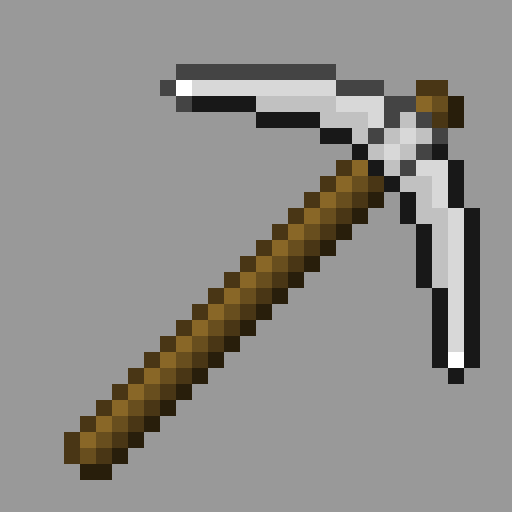

# Better Crafting

<p align="center">
  
  
  
  
  
</p>

<style>
div.cover {
  text-align: center;
}
img.cover {
  width: 80%;
}
</style>

<div class="cover"></div>

A data pack that changes Minecraft, not limited to crafting! Contains easier
tool, weapon and armor usage. There are even more options in the same style in
the description below.

Inspired by [Vanilla Tweaks](http://vanillatweaks.net/) and
[Quark](https://quark.vazkii.net/)

## Installation

The data pack in the project itself is generated with the default and
recommended options, but to customize your data pack, use the following
instructions:

To generate the full content, use the following command:

```
python3 make.py
```

You can adjust the `options.txt` to configure the content to generate

And to delete the generated content, use the following command:

```
python3 clean.py
```

Add this data pack to an existing world:

- Go to your `.minecraft` folder, go to `saves` and enter the world you want
  this data pack installed.
- Go to `datapacks` and copy the `better-crafting` folder inside the project
  folder into the `datapacks`
- Run the game and use the command `/reload` to load the added data packs.

Or generate a world with this data pack. (started from 1.16 Pre-release 1)

Please note that the data pack itself which Minecraft uses is the `better-craft`
inside this folder.

This project requires Python 3.6+

## More ingredients

For more options in the style of this data pack, here's some things you can try:

- Modify some gamerule:
- - Set `doFireTick` to `false`
- - Set `doWeatherCycle` to `false`
- - Set `keepInventory` to `true`
- - Set `mobGriefing` to `false`
- - Set `randomTickSpeed` to `300`
- Use [Optifine](https://optifine.net/downloads) (this should be well-known, but
  just to be sure)
- Use [Faithful](https://faithful.team/)
- Use [Vanilla Tweaks](http://vanillatweaks.net/)
- Use [Quark](https://quark.vazkii.net/)

## Current State

The features that are currently implemented are as follows:

- Mend everything in the players' inventory and make them unbreakable
  (`unbreakableItem`)
- Make productions (slabs and stairs) smeltable and "vineable" (if has the
  original recipe) (`smeltableProducts` and `vineableProducts`)
- Make tools and armor pieces cheaply upgradable using a smithing table
  (wooden/leather -> iron -> diamond) (`upgradableTools`)
- Make some of the crafting products "decraftable". (`decraftableProducts`)
- Implement some of the recipes to be shapeless, which can fit in the 2x2
  crafting in the player's inventory (`shapelessRecipes`)
- Make saplings, mushrooms and fungus craftable from corresponding blocks at 1:1
  ratio (`craftableSaplings`)
- Make ores crafting from mineral and corrosponding stone (`craftableOres`)

## Known Issues

- All MCFunction files aren't working
- Mending a tool and making it unbreakable removes all NBT tags but
  `Unbreakable`
- Cleaning the content with the file opened that should be cleaned might
  duplicate the file, which could cause duplication in the recipe book

## Donation

This project is open-source and free-to-use, it would be really helpful to
support me! For more information, please see my
[Patreon](https://patreon.com/that_peterhunt).

## Contributing

Pull requests are welcome. For major changes, please open an issue first to
discuss what you would like to change.

Please make sure to update tests as appropriate.

## License

[MIT](LICENSE.txt)
